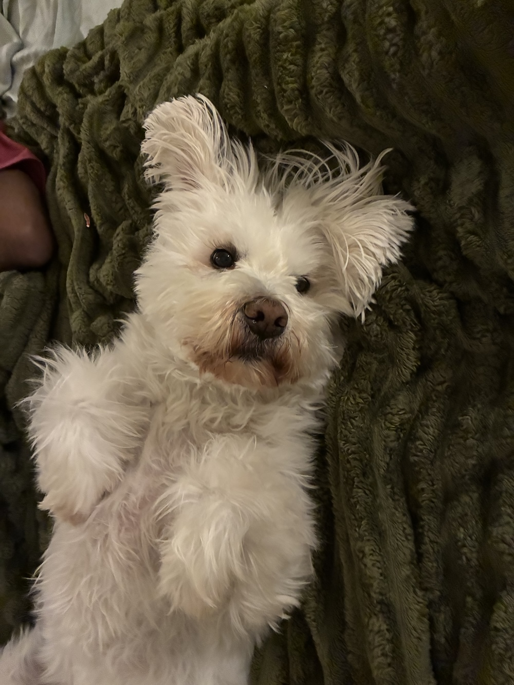
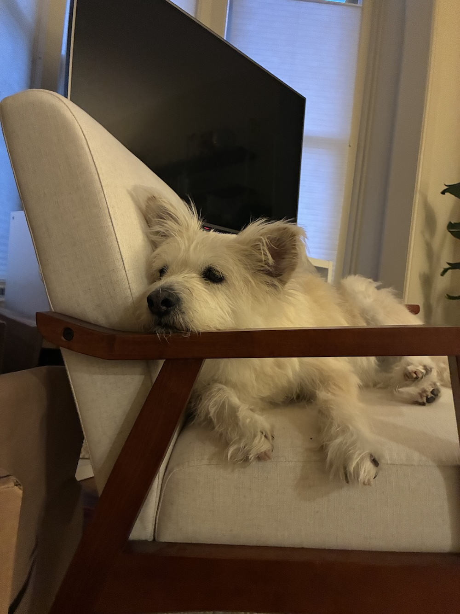
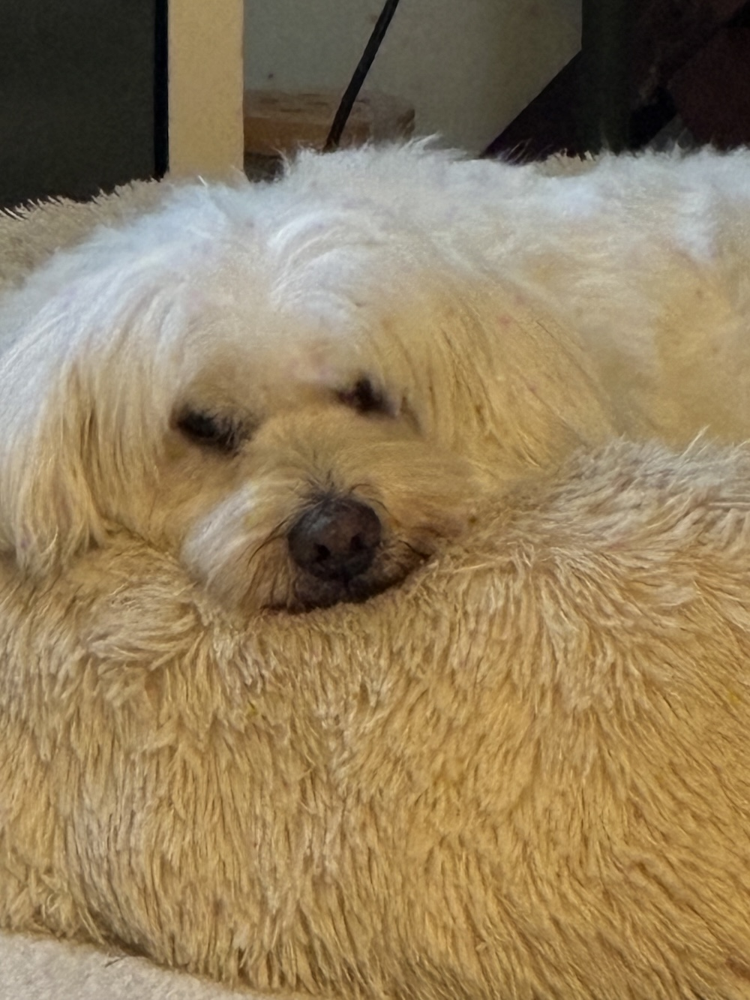
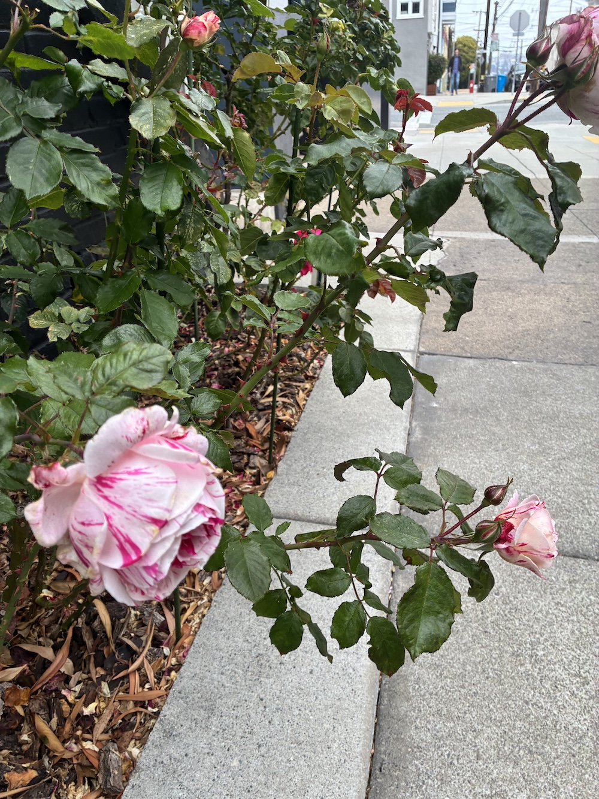

# Where does a pretrained detector fail on my dogs?

A small experiment: run a pretrained YOLOv8n on ~30 of my own photos, collect every detection into a table, and look at the low-confidence and wrong ones. The goal is not accuracy — it is to find the cases that would need human tagging before retraining.

## What I did

1. Ran `yolov8n.pt` (COCO-pretrained, 80 classes) on a folder of photos.
2. Flattened the results into a pandas table: one row per detected box (`file_name`, `cls_name`, `conf`, `x1, y1, x2, y2`).
3. Filtered for `conf < 0.5` and for wrong labels, then checked each against the photo.

Code is in `initial.ipynb`. Put your own photos in `photos/` and run it.

## What I found

The mistakes are not random. They fall into three groups.

### 1. Unusual pose

The model has mostly seen dogs standing or lying flat. A dog on her back, seen from above, looks like a stuffed toy. A dog draped over a chair arm looks like a cat.


`IMG_1760` — predicted **teddy bear (0.68)**. Actual: May, on her back.


`IMG_3936` — predicted **cat (0.57)**. Actual: Hazel, on a chair.

### 2. No edge between object and background

When the dog and the background are the same color and texture, the outline disappears and the model guesses from the rough shape.


`IMG_3468` — predicted **bear (0.46)**. Actual: May, face half buried in a fur cushion.

### 3. The class does not exist

COCO has no "flower" class. The closest thing it knows is "vase", so that is what it says.


`IMG_3398` — predicted **vase (0.66)**. Actual: roses.

## Why this matters

Groups 1 and 2 are fixed by tagging these photos and retraining. Group 3 needs a new class added. A model that is confidently wrong (teddy bear at 0.60) is more dangerous than one that is unsure (bear at 0.39), so confident mistakes go first in the tagging queue.

## Setup

```bash
pip install ultralytics pandas
```
